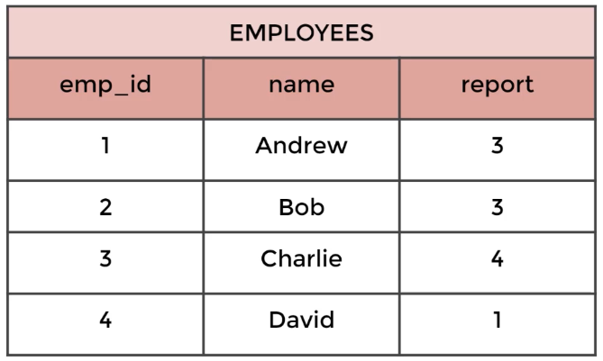

<!--  cSpell:enable  -->
<h1>Complete SQL Boot Camp: Go from Zero0️⃣ to Hero🦸‍♂️!</h1>

Databases are systems that allow users to store and organize data, GREAT with large sets of data. They contain a wide variety of users with various technical skill-sets (sales, ops, engineer, etc.)
</br>
</br>

# From Spreadsheets to Databases

<p>The first step to becoming a database administrator is to learn how to use spreadsheets. </p>

- Spreadsheets are great for small data sets, or a one-time analysis.
- Reasonably sized data sets can be used
- Ability for untrained people to work with data.

</br>
Then we can move on to databases once we understand the spreadsheet.
</br>
</br>

- Better data integrity
- Can handle massive amounts of data
- Quickly combine different datasets
- Automate steps for ure
- Can support data for websites and applications

</br>
Databases have columns and rows just like a spreadsheet, but rather than a 'tab', we have individual 'tables' that contain a given dataset.</br>
</br>
</br>
For this tutorial, we'll be using PostgreSQL, but keep in mind there are many other approaches and abstractions to working in SQL...

- MySQL, Oracle Databases, Microsoft Access, Amazon's Redshift, MemSQL, Periscope Data, Hive (runs on top of hadoop), Google's BigQuery, Facebook's Presto.

</br>

<span style="font-size: 18px">NOTE:</span> <span style="color: lightgreen">We'll use <span style="color: yellow">yellow text</span> to note when we are using a PostGreSQL specific command.</span>

<br />
<br />

# SQL Syntax (can all be applied to any SQL database)

We use all caps for the SQL commands (though we could do lowercase) to differentiate them from the columns, rows, or data objects we're accessing.

<br />
In general, it is not good practice to use an asterisk(*) in the SELECT statement if you don't need all columns. It will automatically query everything, which increases traffic between the database server and the application, which can slow down the retrieval of results.

<br />


<br />
<br />
<br />

The DISTINCT keyword operates on a column and returns only the distinct values in a column. The syntax is...
<br/>
<br/>

```SQL
SELECT DISTINCT column_name FROM table_name
```

<br />
Or, you can place the column name in parenthesis
<br />
<br />

```SQL
SELECT DISTINCT(column_name) FROM table_name
```

<br />
What if we have two of the same distinct instances within a column? We don't know if the returned data is the person with the name "David" as a duplicate entry, or two different people with the same first name... We only that David is one of the distinct 'first_name' values within that column.

### Other useful cases for DISTINCT.

<br />

1. How many different release years do we have? One, 2006 (results from query shown below).

```SQL
SELECT DISTINCT release_year FROM film
```

<br />

2. How many different rental_rates are there? Three,

```SQL
SELECT DISTINCT (rental_rate) FROM film
```

<br />
Let's say we have a visitor from Australia who's not familiar with our movie ratings system in the USA. We want to know... <br /> <br />

1. What types (or, distinct values) of ratings do we have in the database?
   "PG"
   "R"
   "NC-17"
   "PG-13" and
   "G"

```SQL
SELECT DISTINCT rating FROM film;
```

<br />
<br />
<br />

# Count function

By default, the count function returns the number of input rows of a table.

```SQL
SELECT COUNT(*) FROM table_name
```

<br /><br />
By including an argument, the returned query will then match that specific argument/condition.

```SQL
SELECT COUNT(first_name) FROM table_name
```

It will not work without () to pass in the value to be counted.
<br/><br/><br/>

# Comparison operators

- = equal to
- <> not equal to (or !=)
- '> greater than'
- < less than
- '> = greater than or equal to'
- <= less than or equal to

Along with comparison operators, there are 3 logical operators.
<br/><br/><br/>

## AND, OR, and NOT.

- AND - returns true if both conditions are true
- OR - returns true if either condition is true
- NOT - returns true if the condition is false
  <br/><br/>

```SQL
SELECT first_name, choice FROM table_name
WHERE name = 'David'
AND choice = 'red'
```

<br />
How would we find the number of films with a rating of R or PG-13?
<br/>
<br/>

```SQL
SELECT COUNT(*) FROM film
WHERE rating = 'R'
OR rating = 'PG-13'
```

<br/>
<br/>

# Where statement

One of the most fundamental statements alongside SELECT. With Where, we can specify conditions on columns for which rows are to be returned. We decide what columns we want back, then the table, then WHERE to describe the conditions.
<br/>
<br/>

You can combine these in any fashion as long as spelling and syntax are correct. For example, we want the phone # from the customer with the address of '259 Ipoh Drive...

```SQLSQL
SELECT customer FROM customer
WHERE address = '259 Ipoh Drive'
```

<br />
<br />

# Order By

With Order By, we can sort the data by a column in either ascending or descending (order for strings, numerical for numbers)

Basic syntax for ORDER BY...

- Use ASC for ascending order _(Default if left blank)_
- Use DESC for descending order

```SQLSQL
SELECT column_1, column_2 FROM table_name
ORDER BY column_1 ASC/DESC
```

<br />
<br />
You can use ORDER BY on multiple columns. This makes a lot of sense with duplicate entries For example...
<br />
<br />

| Company | Name   | Sales |
| ------- | ------ | ----- |
| Apple   | Andrew | 100   |
| Google  | David  | 500   |
| Apple   | Zach   | 300   |
| Google  | Claire | 200   |
| Xerox   | Steven | 100   |

<br />
To sort by company and then sales in descending order:

```SQL
SELECT company, sales FROM table
ORDER BY company, sales
```

<br />

| Company | Name   | Sales |
| ------- | ------ | ----- |
| Apple   | Andrew | 100   |
| Apple   | Zach   | 300   |
| Google  | Claire | 200   |
| Google  | David  | 500   |
| Xerox   | Steven | 100   |

<BR />

<span style="font-size: 18px">NOTE:</span> <span style="color: lightgreen">You can sort by columns you didn't include in your query request statement. SQL knows that those fields are still there and can access them for purposes outside those we've seen so far.</span>

<br />
<br />

# Limit

- The limit keyword allows us to limit the number of rows returned for a query.
- Useful for not wanting to return every single row in a table, but only view the top few rows to get an idea of the table layout.
- LIMIT also becomes useful in combination with ORDER BY.
- Goes at the very end of a query and is the last command to be executed.

### Limit Syntax:

```SQL
SELECT * FROM payment
WHERE amount != 0.00
ORDER BY payment_date DESC
LIMIT(5)
```

This will return 5 recent payments (not 0) ordered by the payment date in descending order.
<br/>
<br/>
<br/>

# <span style="color: orange">POP QUIZ:</span>

<br />

<span style="color: orange">
1.</span>
 We want to reward the first 10 customers who made a payment. Write a query to gather the customer_ids.
<br />

```SQL
SELECT customer_id FROM payment
ORDER BY payment_date ASC
LIMIT 10
```

<br />

<span style="color: orange">
2.
</span> A customer wants to quickly rent a video over their short lunch break. What are the titles of the 5 shortest (length of runtime) movies?

```SQL
SELECT title FROM film
ORDER BY length ASC
limit 5
```

Now that we know the shortest runtime ('length') is 46 minutes, we can query for how many films there are with that runtime instead of just returning 5. Coincidentally, there are 5 in this example for both queries.

```SQL
SELECT title FROM film
WHERE length = '46'
```

<br />
<span style="font-size: 18px">NOTE:</span> 
<span style="color: lightgreen">'length' is actually a SQL keyword (which is why it's highlighted in PgAdmin), so be careful where you call it as a column name. Do your best to avoid column names that are the same as SQL keywords..</span>
<br />
<br />

<span style="color: orange">
BONUS:
</span>
If the previous customer can watch any movie that is 50 minutes or less in run time, how many options does she have? Answer: 37.

```SQL
SELECT COUNT(title) FROM film
WHERE length <= '50'
```

<br />
<br />

# Between

Can be used to match a value against a range of values

- Value BETWEEN low AND high.
- (Value >= low) AND (value <= high).
- We include the low and high...

Combining NOT with BETWEEN...

- value NOT BETWEEN low and HIGH.
- (value < low) OR (value > high)
- We DO NOT include the low and high, only the value in between them.

<br/>
<br/>

## BETWEEN with DATES!

We can also use this on dates using the following syntax:

```SQL
date_column BETWEEN start_date AND end_date
```

OR...

```SQL
date BETWEEN '2007-01-01' AND '2007-02-01'
```

<span style="font-size: 18px">NOTE:</span>

1. <span style="color: lightgreen">You need to format dates in the ISO 8601 standard format, which is YYYY-MM-DD.</span>
2. <span style="color: lightgreen">When using BETWEEN operator with dates that also include timestamp information, pay careful attention to using BETWEEN versus <=, >= comparison operators, because a datetime start with <span style="color: red">0:00.</span>

<br />
How many payments are there above, or below 9 dollars? <br />Answer: 14157

```SQL
SELECT count(*) from payment
WHERE amount NOT BETWEEN 8 and 9
```

How many payments were there between February 1st, 2007, and February 15th, 2007?

```SQL
SELECT * FROM payment
WHERE payment_date BETWEEN '2007-02-01' AND '2007-02-15'
```

Remember Note 2. above? Here we have an example of this. We're only returning payments up to 2007-02-15, but not including them. We may want to include payments from the 15th, in which case we would search BETWEEN '2007-02-01' and '2007-02-16'

<br /><br />

# ~ IN ~

- You may want to check for multiple possible value options, for example, if a user's name shows up IN/NOT IN list of options.
- We can use the IN/NOT IN operator to create a condition that checks to see if a value is included in a list of multiple options.

Syntax:

- ```SQL
  value IN (option1, option2,...,option_n)
  ```
- ```SQL
  WHERE color IN ('red', 'blue')
  ```
  <span style="color: lightGreen">NOT IN example:</span>
- ```SQL
  WHERE color NOT IN ('green', 'blue')
  ```

Let's say we want to know the number of payments that are not '0.99', '1.98', or '1.99'.

```SQL
SELECT * from payment
WHERE amount NOT IN (0.99, 1.98, 1.99)
ORDER BY amount ASC
```

<br />
<br />

# LIKE and ILIKE

What if we want to match against a general pattern in a string?

- All emails ending in '@gmail.com'.
- All names that begin with an 'A'.

The LIKE operator allows us to perform pattern matching against string data with the use of <span style="color: #ff6941">wildcard</span> characters:

- <span style="color: #ff6941; font-size: 24px">Percent %</span>
  - Matches any sequence of characters
- <span style="color: #ff6941; font-size: 24px">Underscore \_</span>
  - Matches any single character.

<br />

## Using %

- All names that <span style="color: orange">begin</span> with an 'A'.
  - WHERE name LIKE <span style="color: orange">'A%'</span>
  - Saying: match any name where the first letter is 'A' followed by and sequence of characters.
- All names that <span style="color: orange">end</span> with an 'a'
  - WHERE name LIKE <span style="color: orange">'%a'</span>
  - Saying: match any name where the last letter is 'a', preceded by and sequence of characters.

<br />

You can use ANY combinations of \_ and %! Let's find the first_name and email of anyone who has an 'er' in their name - How? Br wrapping % on both sides of what we're looking for we're asking for "any 'er' with any other characters on either side".

```sql
SELECT first_name, email from customer
WHERE first_name ILIKE '%er%'
```

<br />

NOTE:

- <span style="color: lightGreen"> LIKE is case-sensitive, </span>
- <span style="color: lightGreen"> <span style="color: red">I</span>LIKE is case-<span style="color: red">in</span>sensitive, </span>

<br />
 
## Using \_

Using the underscore allows us to replace just a single character.

<br />

NOTE:

- <span style="color: lightGreen">You can combine LIKE and ILIKE operators for far greater detail
- <span style="color: lightGreen"><span style="background: darkred">REGEX expressions are fully supported in SQL!</span>

Get all customer names that are some letter, followed by 'her', then any combination of letters.

```sql
SELECT first_name FROM customer
WHERE first_name LIKE '_her%'
```

How many people's name starts with just the letter J?

```sql
SELECT count(*) FROM customer
WHERE first_name LIKE 'J%'
```

<br />
<br />
<br />

# <span style="color: purple; font-style: italic">CHALLENGE! 😰</span>

1. How many payment transactions were greater than $5.00?
   - ```sql
      SELECT COUNT(*) FROM payment
      WHERE amount > 5.00
     ```
2. How many actors have a first name that starts with the letter P?
   - ```sql
      SELECT COUNT(actor) FROM actor
      WHERE first_name LIKE 'P%'
     ```
3. How many unique districts are our customers from?
   - ```sql
     SELECT DISTINCT (COUNT(district)) FROM address
     ```
4. Retrieve the list of names for those distinct districts from the previous question.
   - ```sql
     SELECT DISTINCT (district) FROM address
     ```
5. How many films have a rating of R and a replacement cost between $5 and $15? Answer: 52.
   - ```sql
     SELECT COUNT(FILM) FROM film
     WHERE rating = 'R'
     AND replacement_cost BETWEEN 5 AND 15
     ```
6. How many films have the word Truman somewhere in the title?
   - ```sql
     SELECT COUNT(*) FROM film
     WHERE title LIKE '%Truman%'
     ```

<br />
<br />
<br />

# GROUP BY

Allows us to aggregate data and apply functions to better understand how data is distributed per category.

## Aggregate Functions

Further info: https://www.postgresql.org/files/documentation/pdf/16/postgresql-16-US.pdf

SQL provides a variety of aggregate functions but some of the most common are:

- AVG() and ROUND() - returns the average value (returns 2.41512346112347898).
  - Use ROUND() function to specify the precision of decimals.
  - (1st parameter = to be rounded, 2nd parameter = # of decimal places to round)
- COUNT() - returns number of values
- MAX() - returns maximum value
- MIN() - returns minimum value
- SUM() - returns the sum of all values.

NOTE: <span style="color: lightGreen">Aggregate function calls happen only in the SELECT clause of the HAVING clause.</span>

<br />

### MIN and MAX

We know now we'll have to spend at least 9.99 to replace a film, OR at most 29.99

```SQL
SELECT MIN(replacement_cost) A FROM film
```

```SQL
SELECT MAX(replacement_cost) A FROM film
```

<br />

This is messy and repetitive. Instead, <span style="color: orange">we can separate the aggregate function calls with a comma.</span> They're both returning a singular value so this sort of query makes sense.

```SQL
SELECT MAX(replacement_cost),MIN(replacement_cost) FROM film
```

<br />

### AVG and ROUND

```SQL
SELECT AVG(replacement_cost) FROM film
```

We get waaaaaaay too many decimal points here. So, let's use the ROUND function, which takes in the 1st parameter as the value to be rounded, and the second as the number of decimal points to round to.

```SQL
SELECT ROUND(AVG(replacement_cost),2) FROM film
```

<br />

### SUM

```SQL
SELECT SUM(replacement_cost) FROM film
```

<br />
<br />

## GROUP BY - Part One - Theory

Allows us to aggregate columns per some category.

Things to consider:

1. We need to choose a <span style="color: orange">categorical</span> column to GROUP BY
2. Categorical columns are non-continuous
3. Keep in mind, they can still be numerical, such as cabin class categories on a ship( e.g. Class 1, Class 2, Class 3)

| Category | Data Value |
| -------- | ---------- |
| A        | 10         |
| A        | 5          |
| B        | 2          |
| B        | 4          |
| C        | 12         |
| C        | 6          |

Considering the table above, we have category A, then B, then C. Remember, an aggregate function takes a group of numbers and returns a single value. So, the 10 & 5, 2 & 4, and 12 & 6 for each respective category would SUM to 15, 6, and 18, respectively.

Or AVG, or COUNT, etc...

<br />

Group by Syntax:

```SQL
SELECT category_col, AGG(data_col)
FROM table
GROUP BY category_col
```

NOTE:

- <span style="color: lightGreen">The GROUP BY clause must appear right after a FROM or WHERE statement</span>
- <span style="color: lightGreen">In the SELECT statement, columns must either have an aggregate function or be the GROUP by call.</span>

<br />

For Example:

```SQL
SELECT company, division, SUM(sales)
FROM finance_table
WHERE division IN ('marketing', 'transport')
GROUP BY company, division
```

WHERE statements should not refer to the aggregation result (SUM(sales)), later on, we will learn to use HAVING to filter those results.

Here's an example we've been working with:

```sql
SELECT amount, customer_id, SUM(amount)
FROM payment
WHERE amount != 0
GROUP BY customer_id,amount
ORDER BY SUM(amount) DESC
LIMIT 5
```

This is to say: "Find me the top 5 customers with the highest payments" - Sorted from highest to lowest, omitting anyone with 0 payment.

<br />
<br />

## GROUP BY - Part Two - Implementation

Which customer has the highest payment?

```SQL
SELECT customer_id,SUM(amount) FROM payment
GROUP BY customer_id
ORDER BY SUM(amount) DESC
```

Which customer has the highest number of payments?

```sql
SELECT customer_id,COUNT(amount) FROM payment
GROUP BY customer_id,
ORDER BY COUNT(amount) DESC
```

<br />

### Using GROUP BY on multiple columns.

We can find the highest transactions made between which customer and which employee.

```sql
SELECT customer_id,staff_id,SUM(amount) FROM payment
GROUP BY staff_id, customer_id
ORDER BY customer_id
```

<br />
<br />

### Using the DATE() function with GROUP BY

Simply call the DATE() function to convert the timestamped format to the standard YYYY-MM-DD format.

Below, we're able to find the days on which the lowest (ASC) amount transactions took place.

```SQL
SELECT DATE(payment_date), SUM(amount) FROM payment
GROUP BY DATE(payment_date)
ORDER BY SUM(amount)
```

<br />
<br />

# <span style="color: purple; font-style: italic">GROUP BY CHALLENGE! 🏘️</span>

We have two staff members, with Staff IDs 1 and 2. We want to give a bonus to the staff member that handled the most payments. (most in terms of the number of payments processed, not the dollar amount).

How many payments did each staff member handle and who gets the bonus?

```sql
SELECT rating, ROUND(AVG(replacement_cost), 2) FROM film
GROUP BY rating
ORDER BY AVG(replacement_cost)
```

<details> 
<summary>Answer: </summary>



</details>

SELECT rating, AVG(replacement_cost) FROM film
GROUP BY rating
ORDER BY AVG(replacement_cost)

<br />
<br />

What is the average replacement cost per MPAA rating?

- You may need to expand the AVG column to view correct results.

```sql
SELECT rating, AVG(replacement_cost) FROM film
GROUP BY rating
ORDER BY AVG(replacement_cost)
```

<details> 
<summary>Answer: </summary>


</details>

<br />
<br />

Running promotion to reward our top 5 customers with coupons. What are the customer IDs of the top 5 customers by total spend?

```sql
SELECT customer_id, SUM(amount) from payment
GROUP BY customer_id
ORDER BY SUM(amount) DESC
limit 5
```

<details> 
<summary>Answer: </summary>


</details>

<br />
<br />
<br />
<br />
<br />

# Having

Having clause allows us to filter after an aggregation has already taken place. From before..

```SQL
SELECT company, SUM(sales)
FROM finance_table
WHERE company != 'Google'
GROUP BY company
```

We've already seen we can filter before executing the GROUP BY, but what if we want to filter based on SUM(sales)?

<br />

NOTE: <span style="color: lightGreen">We can not use WHERE to filter based off of aggregate results, because those happen after a WHERE is executed.</span>

<br />

<span style="color: green">HAVING</span> allows us to use the aggregate result as a filter along with a GROUP BY.

This is to say - "Go ahead and do a filter with the where for all company's other than Google, then group by those companies, then only return those having more than 1000 in sales.

```sql
SELECT customer_id, SUM(amount)
FROM payment
WHERE customer_id NOT IN (184,87,477)
GROUP BY customer_id HAVING SUM(amount) > 100
```

<details> 
<summary>Solution: </summary>


</details>

<br />
<br />

Another example of using HAVING to filter the aggregate result... (Stores with more than 300 customers)

```sql
SELECT store_id,COUNT(customer_id)FROM customer
GROUP BY store_id
HAVING COUNT(customer_id) > 300
```

<br />
<br />

# <span style="color: purple; font-style: italic">Challenge tasks for HAVING 🎒⛏️</span>

We are launching a platinum service for our most loyal customers. We will assign platinum status to customers that have had 40 or more transaction payments.

What customer_ids are eligible for platinum status?

```sql
SELECT customer_id, COUNT(payment_id)
FROM payment
GROUP BY customer_id
HAVING COUNT(payment_id) >= 40
```

<details> 
<summary>Solution: </summary>


</details>

<br />
<br />

What are the customer ids of customers who have spent more than $100 in payment transactions with our staff_id member 2?

```sql
SELECT customer_id, staff_id,SUM(amount) FROM payment
WHERE staff_id = 2
GROUP BY customer_id, staff_id
HAVING SUM(amount) > 100
ORDER BY SUM(amount)
```

<details> 
<summary>Solution: </summary>


</details>

<br />
<br />
<br />
<br />

# ASSESSMENT TEST:

1. Return the customer IDs of customers who have spent at least $110 with the staff member who has an ID of 2 (Answer: 187 and 148).

```sql
SELECT customer_id, SUM(amount) FROM payment
WHERE staff_id = 2
GROUP BY customer_id
HAVING SUM(amount) > 110
ORDER BY SUM(amount)
```

2. How many films begin with the letter J? (Answer: 20)

```sql
SELECT COUNT(*) FROM film
WHERE title LIKE 'J%'
```

3. What customer has the highest customer ID number who's name starts with an 'E' and has an address ID lower than 500 (Answer: Eddie Tomlin)

```SQL
SELECT * FROM customer
WHERE first_name LIKE 'E%'
AND address_id < 500
ORDER BY customer_id DESC

```

Lets pull out the customer who has the most sales with staff_id #2

```sql
SELECT * FROM customer
WHERE first_name LIKE 'E%'
AND address_id < 500
ORDER BY customer_id DESC
LIMIT 3;
```

<br />
<br />
<br />
<br />
<br />

# JOINS

JOINS allow us to combine information from multiple tables.

First, we'll learn how to create an alias with the AS clause. Then, we'll move on to the 4 joins listed below.

- INNER JOINS
- OUTER JOINS
- FULL JOINS
- UNIONS
  <br />

### AS Statement

Syntax for re-declaring a column name using AS:

```sql
SELECT column AS new_name FROM table
```

So, a real world example might be...

```sql
SELECT amount AS rental_price FROM payment
-- Or ...
SELECT SUM(amount) AS net_revenue FROM payment
```

<br />
<br />

<span style="font-size: 18px">NOTE:</span> <span style="color: lightgreen"> The AS operator gets executed at the very end of a query, meaning that we can not use the ALIAS inside a WHERE operator.

```sql
SELECT COUNT(amount) FROM payment
```

We can use AS conveniently to rename selections into what they "actually" are. These names are fore the column headers only.

Here, it's hard to tell specifically what we want, other than customer_id information and a sum of the amount.

```sql
SELECT customer_id, SUM(amount) FROM payment
GROUP BY customer_id
```

<br />
We can tidy this up by renaming the selection into.

```sql
SELECT customer_id AS cust_id, SUM(amount) AS total_spent
FROM payment
GROUP BY customer_id
```

<br />
<span style="font-size: 18px">NOTE:</span> <span style="color: lightgreen"> When calling on a column using HAVING, you have to use the original column name (SUM(amount)) and not the alias (total_spent) because the AS assignment happens at the very end.</span>

```sql
-- ! BAD SQL ! --
SELECT customer_id, SUM(amount) AS total_spent
FROM payment
GROUP BY customer_id
HAVING total_spent > 100
```

 <br />

### Now that we know how to use AS, let's to back to JOINS...

 <br />

## INNER JOINS

<span style="color: orange">INNER JOINS</span> will result with the <span style="color: orange">set of records that match in both tables</span>.

Let's start by assuming our company is holding a conference for people in the movie rental industry. We'll have people register online (REGISTRATIONS) beforehand and then login the day of the conference (LOGINS). We're going to assume there are no duplicate first names.

We want to know who has registered for the event, and also who has logged in.

<br />

##### We're saying - "Grab table A and then grab table B. Because it's an inner join, only grab the rows that happen to be in both tables A and B. Join them ON TableA columns that match TableB columns.

#### Syntax:

```sql
SELECT * FROM TableA
INNER JOIN TableB
ON TableA.col_match = TableB.col_match
```


<br />
<br />

### Working example:


<br />


<br />

Now we have A LOT of results! But, we have duplicate name columns (because we selected \*) with duplicate information and we know that's not how we like to do things.

To clean this up, we can declare specific columns that we want. Below (syntax example), We're saying select 3 things: Registration ID, Login names, and Login ID from the Registrations table. Then, join Logins where the names are equal to each other... However, because 'name' existed in both tables, and as we saw before, it will simply produce both columns with the same 'name' header. <span style="color: orange"> Here, we're only returning the Logins.name column (we could also use registrations.name, it doesn't matter since they're the same)</span>


<br />
<br />

#### <span style="color: orange"> REMEMBER! </span>

- Table order won't matter in an INNER JOIN
- Also, if you see JOIN without the INNER, PostgreSQl will treat it as an INNER JOIN

<br />
<br />

#### This request pulls back all fields using the the JOIN with the same customer_id.

```sql
SELECT * FROM payment
JOIN customer
ON payment.customer_id = customer.customer_id
```

<br />

Let's widdle it down a bit and only select certain columns.

- If we're referring to a column name that only exists in one table we don't have to do anything specific
- If both tables contain the same column name (customer_id), then we can specify which table we want to use it from.
  - Since we're already pulling FROM the payment table, it would be best practice to use that one...

```sql
SELECT payment_id, payment.customer_id, first_name
FROM payment
JOIN customer
ON payment.customer_id = customer.customer_id
```

The above only JOINS customers FROM payment who have an existing payment (FROM payment), and that are both on the customer and payment table with matching ids.

<br />
<br />
<br />

# FULL (OUTER) JOINS


- There are a few different types of OUTER (OUTER) JOINS
- They will allow us to specify how to deal with values only present in one of the tables being joined.
- There are the more complex JOINs, take your time!

#### Below, we'll explain...

- FULL JOIN (Clarifying WHERE null)
- LEFT JOIN (Clarifying WHERE null)
- RIGHT JOIN (Clarifying WHERE null)

<br />
<br />

First, let's describe the FULL (OUTER) JOIN.

syntax: Select all the columns from table A, and join all of Table B.

```sql
SELECT * FROM TableA
FULL JOIN TableB
ON tableA.col_match = TableB.col_match
```

A more realistic example might be...

```sql
SELECT * FROM Registrations
FULL JOIN Logins
ON Registrations.name = Logins.name
```

The returned table will contain the matches where the names exist in both columns, but since we asked to return all, what about the rows where the names don't match? It will place <span style="color: orange">'null'</span> instead of the values into those rows.

| reg_id                                  | Name                                    | log_id                                  | name                                    |
| --------------------------------------- | --------------------------------------- | --------------------------------------- | --------------------------------------- |
| 1                                       | Andrew                                  | 2                                       | 2023-01-05                              |
| 2                                       | Bob                                     | 4                                       | 2023-01-06                              |
| 3                                       | Charlie                                 | <span style="color: orange">null</span> | <span style="color: orange">null</span> |
| 4                                       | David                                   | <span style="color: orange">null</span> | <span style="color: orange">null</span> |
| <span style="color: orange">null</span> | <span style="color: orange">null</span> | 1                                       | Xavier                                  |
| <span style="color: orange">null</span> | <span style="color: orange">null</span> | 3                                       | Yolanda                                 |

<br />
<br />

### Full OUTER JOIN with WHERE - Get rows unique to either table (rows not found in both tables)

Meaning, we're looking for the actual values where one of the rows is null. This grabs the rows that are completely unique to either Table A, or Table B.

Syntax: (see diagram above for example venn diagram of an [Exclusive] Full Join)

```sql
SELECT * FROM TableA
FULL OUTER JOIN TableB
ON TableA.col_match = TableB.col_match
WHERE Table.id IS null OR Table.id IS null
```

```sql
SELECT * FROM Registrations
FULL OUTER JOIN Logins
ON Registrations.reg_id = Logins.log_id
WHERE Registrations.reg_id IS null
OR Logins.log_id IS null
```

<br />
<br />

Using the table from above, we would now see all results that are unique to the either the Registration table, or the Login table.

| reg_id | Name    | log_id | name    |
| ------ | ------- | ------ | ------- |
| 3      | Charlie | null   | null    |
| 4      | David   | null   | null    |
| null   | null    | 1      | Xavier  |
| null   | null    | 3      | Yolanda |

<br />
<br />

Let's do an example in PgAdmin! We want to ensure that we don't have any customer information that's not tied to a payment, or any payment information that's not tied to a customer. Luckily, there are none.

```sql
SELECT * FROM customer
FULL OUTER JOIN payment
ON customer.customer_id = payment.customer_id
WHERE customer.customer_id IS null
OR payment.payment_id IS null
```

<details> 
<summary>Solution: </summary>


</details>
 
 <br />

Let's double check by counting the distinct IDs - You'd have to check each table and ensure the numbers match. There also could be different id numbers in different tables.

```sql
SELECT COUNT(DISTINCT customer_id) FROM payment.
```

<br />
<br />
<br />


# LEFT (OUTER) JOIN

NOTE: 
- <span style="color: lightgreen">With both LEFT and RIGHT JOINS, the order we enter the query now matters, since we have to specify what the left table will be.</span>
- <span style="color: lightgreen">LEFT OUTER JOIN, and RIGHT OUTER JOIN can both be shorted to simply LEFT JOIN and RIGHT JOIN </span>

<br />

A LEFT OUTER JOIN results in the set of records that are in the left table, if there is no match with the right table, the results are null.

Think of a venn diagram with the left circle and center filled up with the right circle being empty.

Syntax

```sql
SELECT * FROM TableA
LEFT OUTER JOIN TableB
ON TableA.col_match = TableB.col_match
```

<br />

<span style="color: orange">If something is only found in tableB, it will not be returned in the query.</span>

Let's explore this with our login example.

- Grab everything from the Registrations table
- If there happens to be a match with the logins table, then go ahead and return it.
- If there is no match, we're still going to grab the information from left hand table (Logins), and place 'null' in as the value.

```sql
SELECT * FROM Registrations
LEFT OUTER JOIN Logins
ON Registrations.name = Logins.name
```

<br />

| reg_id | Name    | log_id | name   |
| ------ | ------- | ------ | ------ |
| 1      | Andrew  | 2      | Andrew |
| 2      | Bob     | 4      | Bob    |
| 3      | Charlie | null   | null   |
| 4      | David   | null   | null   |

<br />

As we did before, let's further qualify this with a WHERE statement to get rows only unique to the left table.

```sql
SELECT * FROM Registrations
LEFT OUTER JOIN Logins
ON Registrations.name = Logins.name
WHERE Logins.id IS null
```
<details> 
<summary>Visualization: </summary>


</details>

<br />
<br />

PgAdmin examples! Let's look at the film and inventory tables. We're returning the rows that are either just in the film table, or in both the film and inventory table.

Adding the WHERE, it filters it to films that are not in inventory, or in any store! But, we do have information available on them.

```sql
SELECT film.film_id,title, inventory_id FROM film
LEFT JOIN inventory ON
inventory.film_id = film.film_id
WHERE inventory.film_id IS null
```
<details> 
<summary>Solution: </summary>

### <span style="color: red">Not in inventory!</span>


</details>

<br />
<br />

# RIGHT (OUTER) JOIN

Essentially the exact same that as a LEFT JOIN, but the tables are switched up... Yes, it is sorta confusing the LEFT JOIN excludes the right table, and the RIGHT JOIN excludes the left table.

You can apply a 'WHERE TableA.id IS null' to either join to exclude the results that match both columns (see below).


<details> 
<summary>Visualization: </summary>


</details>

<br />

NOTE: <span style="color: lightGreen; textSize: 30px"> It is up to you how you have the tables organized "in your mind" when it comes to choosing a LEFT vs RIGHT join, since depending ont he table order you specify in the JOIN, you can perform duplicate JOINs with either method.

<br />
<br />

# UNION

A UNION is essentially stacking the return queries from SELECT statements.

You can have multiple UNION calls in one query to combine results.

Syntax:

```sql
SELECT * FROM Sales2021_Q1
UNION
SELECT * FROM Sales2021_Q2  
UNION
SELECT * FROM Sales2021_Q3
ORDER BY name
```

*** UNION calls don't have a good use case example in the dvdRental examples we've been using so we'll revisit it later on... ***

### JOIN Challenge tasks.

1. California sales tax laws have changed and we need to alert our customers to this through email. 
  - What are the emails for the customers who live in California?

```sql
SELECT email, district FROM address
LEFT JOIN customer 
ON address.address_id = customer.address_id
WHERE district = 'California'
```
<details> 
<summary>Solution: </summary>

- Remember, you could use an INNER or RIGHT join here.
- You could also switch the FROM and LEFT JOIN tables in this basic example and it would be the same result.

<br />


</details>

<br />

2. A customer walks in to the store adn there a huge fan of the actor "Nick Wahlberg" and wants to know what movies he is in.
  - What movies are they in?

We first need to identify what table is the "go between", "link", "bridge", (call it what you want) to get us the information in the prompt. 

The film table doesn't have direct information for what actors there are, only the title... So, we at least know we'll need the film table 

The actor table has the actor_id, <span style="color: orange">AND </span>the film_actor table has both the actor_id id. 

So, we first join the the film_actor table on the actor on matching actor and film_actor id. This would return the list of matching actor/film ids, but not the titles.

```sql
SELECT * FROM actor
INNER JOIN film_actor
ON actor.actor_id = film_actor.actor_id
```

This is where we would perform a 2nd JOIN of the film table onto the existing table (film_actor joined on actor) where actor_id matches the film_id.

```sql
SELECT * FROM actor
INNER JOIN film_actor ON actor.actor_id = film_actor.actor_id
INNER JOIN film ON film.actor_id = film.film_id
```

This is a good start, but this doesn't specify "Nick Wahlberg" anywhere, or if 'actor_id = 2'. So, we add a WHERE with this condition to the end.

```sql
SELECT title, first_name, last_name FROM film_actor
INNER JOIN actor ON film_actor.actor_id = actor.actor_id
INNER JOIN film ON film_actor.film_id = film.film_id
WHERE actor.actor_id = 2
```

<br /><br />

# Advanced SQL topics

These topics don't fit into the general flow of the previous section so we'll go over them one at a time here.

We'll go over commands that report back date and time information, as well as topics that will be useful when creating our own tables and databases.

## Timestamps and Extracts - Part One

TIME - Contains only time

DATE - Contains only date

TIMESTAMP - Contains date and time

TIMESTAMPTZ - Contains date, time, and timezone.

<br />

<span style="color: orange">REMEMBER: You can always remove historical information, but you can't add it!

Functions and operations related to these specific data types:

  - TIMEZONE
  - NOW()
  - TIMEOFDAY()
  - CURRENT_TIME
  - CURRENT_DATE

  <br />
  <br />

SHOW ALL - Will return a large list of parameters for your SQL environment.

Let's checkout timezone... (returns 'America/Chicago' format timezone)

```sql
SHOW TIMEZONE
```
Returns timezone stamp of the immediate moment.
```sql
SELECT NOW()
```

If you'd like a more user friendly format,<span style="color: orange"> a literal string interpretation</span> , use TIMEOFDAY()
```SQL
SELECT TIMEOFDAY()
```
Or, grab the current time
```sql
SELECT CURRENT_TIME
```
Or, the current date
```sql
SELECT CURRENT_DATE
```
<br />
<br />

## Timestamps and Extracts - Part Two

Let's explore extracting information from a time based data type using:
  - EXTRACT()
  - AGE()
  - TO_CHAR()

<br />

### EXTRACT()

Allows you to "extract" or obtain a sub-component of a date value.
  - YEAR
  - MONTH
  - DAY
  - WEEK
  - QUARTER

Syntax:
```sql
EXTRACT(YEAR FROM date_col)
```

### AGE()

Calculates and returns the current age given a timestamp
Syntax:
```sql
AGE(date_col)
```

13 years 1 mon 5 days: 01:34:13.003425

### TO_CHAR()

General function to convert data types to text. Very useful for timestamp formatting.
Syntax:
```sql
TO_CHAR(date_col, 'mm-dd-yyyy')
```

<br />
<br />

A working example  would be...
```sql
SELECT EXTRACT(YEAR FROM payment_date) AS pay_year FROM payment
```
Or... 

NOTE:<span style="color: orange"> When using WHERE you cannot call on the created variable name (pay_quarter), you have to call on the argument for the variable (EXTRACT(QUARTER FROM payment_date))</span>
```sql
SELECT EXTRACT(QUARTER FROM payment_date) AS pay_quarter FROM payment
WHERE EXTRACT(QUARTER FROM payment_date) = 4
```

How old is a particular timestamp in regards to our current date?

```sql
SELECT AGE(payment_date) FROM payment.
```
<br />
<br />

# TO_CHAR()

```sql
SELECT TO_CHAR(payment_date, 'YYYY/MM/DD HH24:MI:SS') as formatted_time FROM payment
```

Google 'SQL time formatting' to get a full list of options, there are tons! 

<br /><br />
<br />

# CHALLENGE!

- During which months did payments occur?
  -  Format your answer to return back the full month name.

```sql
SELECT DISTINCT(TO_CHAR(payment_date, 'Month')) payment_date FROM payment
```
<details> 
<summary>Solution: </summary>


</details>

<br />
<br />

- How many payments occurred on a Monday?
  - We had to google the 'dow' function, day-of-week, which pulls out a numeric number (0-6, Sunday-Saturday) for each day of the week.
 
```sql
SELECT COUNT(EXTRACT(DOW FROM payment_date)) FROM payment
WHERE EXTRACT(DOW FROM payment_date) = 1
```
A cleaner answer would be...

```sql
SELECT COUNT(*) FROM payment
WHERE EXTRACT(DOW FROM payment_date) = 1
```

<br />
<br />
<br />

# Mathematical Functions
[PgSQL Mathematical functions documentation](https://www.postgresql.org/docs/current/functions-math.html)

We're going to go through some mathematical operations where we can add one column, or do something, with column and another (or 2 or 3...)

Back to PgAdmin: What percentage of the replacement cost is a rental rate?

```sql
SELECT rental_rate/replacement_cost FROM film
```


<details> 
<summary>Returns: </summary>


</details>

This is a good start, but it's a long number, not in the right form and for each row of the table... Let's clean it up.

```sql
SELECT ROUND(rental_rate/replacement_cost, 2)*100 AS percent_cost FROM film
```
Now we get back a good looking percent format! (33.00, 28.00, etc)

<br />
<br />
<br />

# String Functions and Operators

We can edit, combine, and alter text data columns in PgSql.

[String Functions and Operators documentation](https://www.postgresql.org/docs/16/functions-string.html)

Let's use the customer table.

In PgSQL, we use || as the 'concat' operand, so..

```sql
SELECT first_name || ' ' || last_name as full_name 
FROM customer
```
You can change the case type of a string easily using UPPER() or LOWER()
```sql
SELECT UPPER(first_name) || ' ' || lower(last_name) as full_name FROM customer
```

What if there were missing emails, but we had the name information used to create the email (in our format)?

```sql
SELECT first_name || last_name || '@gmail.com' FROM customer
```
<details> 
<summary>Returns: </summary>


</details>

<br />
<br />

This is a very basic approach to creating emails. Let's assume we dont want the first letter of the last name capatilized, we only want the first letter for the first name capatalized, and we want '@gmail.com' for each...

```sql
 SELECT UPPER(LEFT(first_name, 1)) 
 || LOWER(last_name) 
 || '@gmail.com' as customer_email 
 FROM customer
```
<details> 
<summary>Returns: </summary>


</details>
<br />
<br />
<br />

# Subquery

Sub queries are queries nested inside another query. They allow you to perform complex operations by combining multiple tables and performing calculations on them.

Another way to say it is; A sub query is a query that is nested inside another query and returns one row for each result produced by the outer query.

## selfjoin